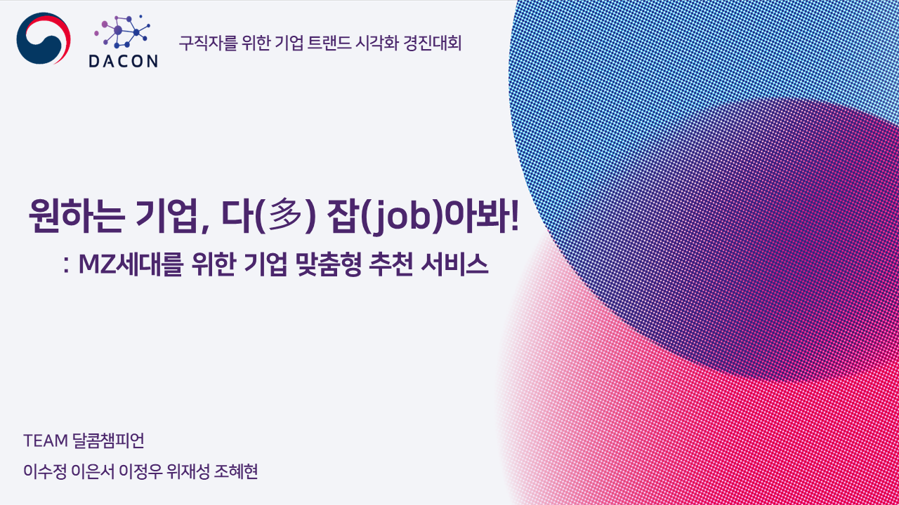
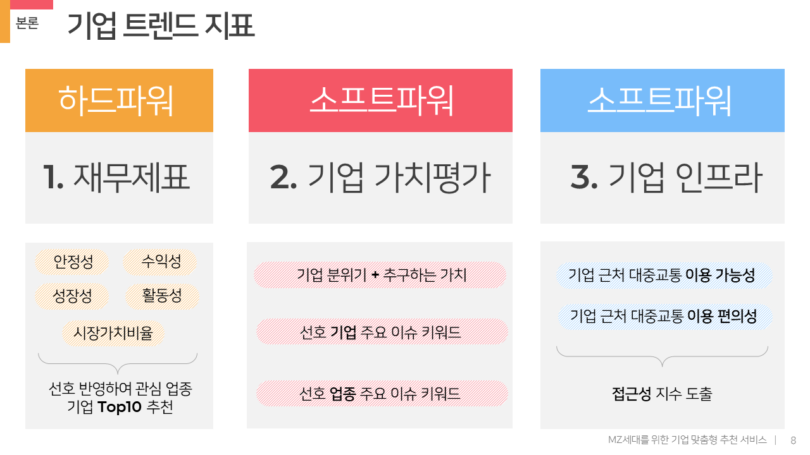

# 원하는 기업, 다(多) 잡(job)아봐!
DACON 구직자를 위한 기업 트렌드 시각화 경진대회 공모작입니다.

기간: 2021.12 - 2022.01

## 과정 요약
1. 참조한 논문을 통해 기업 트렌드 지표를 생성했습니다. → `재무제표` `기업 가치평가` `기업 인프라`
2. `재무제표` : 각 기업의 재무제표에 나타난 재무지표를 이용해 재무지수를 산출했습니다.
3. `기업 가치평가` : 뉴스 데이터 및 기업 홈페이지 정보를 이용, 토픽 모델링과 키워드 추출을 통해 기업 최신 이슈와 기업 분위기를 나타냈습니다.
4. `기업 인프라` : 대중교통 서비스인 지하철, 버스와 기업의 교통 접근성을 계산한 후 접근성 지수를 산출했습니다.
5. 각 트렌드 지표에서 생성한 결과를 모아 하나의 서비스로 구현해보았습니다.

